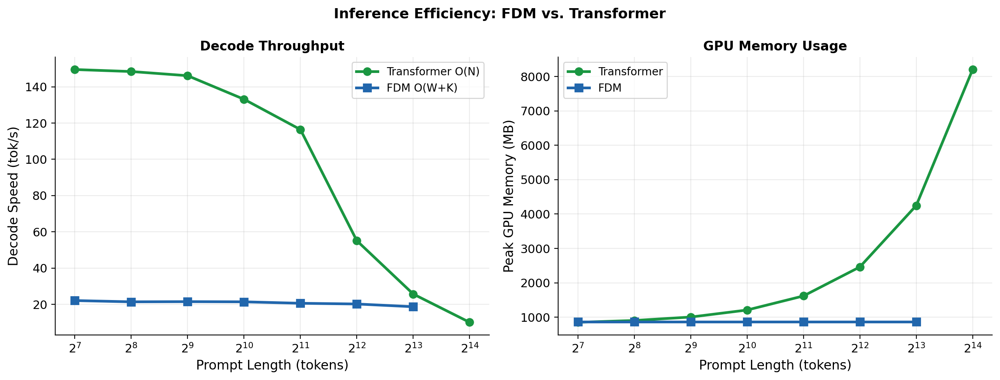

# FDM: Fan Duality Model
### Breaking the KV Cache Bottleneck: O(1) Decode Memory with Superior Associative Recall

[](https://arxiv.org/abs/2604.07716)
[](LICENSE)

---

## 🔑 Key Results

| Property | Transformer | **FDM (Ours)** |
|----------|-------------|----------------|
| Decode memory @ N=8192 | 4,247 MB | **867 MB (fixed)** |
| Decode memory @ N=128 | 853 MB | **867 MB (fixed)** |
| MQAR accuracy (K=16) | 0.606 | **0.966** |
| WikiText-103 PPL | 36.3 | 64.9 |
| Training efficiency | baseline | **14× faster (Freeze-Scan)** |
| Decode speed degradation | 83% (149→25 tok/s) | **15% (22→18 tok/s)** |

**FDM decode memory is strictly O(1)** — fixed at 867 MB regardless of prompt length.
Transformer KV cache grows linearly from 853 MB to 4,247 MB at N=8,192.
## 📊 O(1) Memory vs. Transformer



*(FDM maintains a flat 867MB memory footprint during decoding, completely eliminating the OOM issues plaguing modern LLM deployment.)*

---
---

## 🚀 Quick Start

```python
import torch
from train_130m import Hv2LM, CONFIGS

# Load pretrained FDM (137M parameters)
cfg = CONFIGS['130m'].copy()
cfg['max_len'] = 1040
model = Hv2LM(vocab_size=100277, local_window=256, **cfg)
ckpt = torch.load('checkpoints/hv2_freeze_scan_cont_best.pt', map_location='cpu')
model.load_state_dict(ckpt['model_state'], strict=False)
model.eval()

# O(1) inference: fixed memory regardless of sequence length
h_re, h_im, cache = model.init_state(batch_size=1)
token = torch.tensor([1234])  # your token id
logits, h_re, h_im, cache = model.forward_step(token, h_re, h_im, t_step=0, cache=cache)
next_token = logits.argmax(-1)
```

**Decode memory stays at 867 MB whether your prompt is 128 or 8,192 tokens.**

---

## 📐 Architecture

FDM separates sequence processing into two complementary components:

```
Input x_t
    │
    ├──► Wave Component (Fan Operator)
    │    ├── Adaptive measurement rate: p_t = sigmoid(β_t·log(t+2) + W_pos·PE(t) + μ) × 0.5 + ε
    │    ├── Two-pass Givens rotation scan (Born approximation)
    │    └── Output: h_t ∈ ℂ^D  ← holographic plate encoding full history
    │
    └──► Particle Component (Local-Global Cache)
         ├── Local window: last W=256 tokens
         ├── Global landmarks: TopK(s_eff, K=16) — most informative positions
         ├── Total slots: W+K = 272 (CONSTANT, independent of N)
         └── Decode memory: O(W+K) = O(1) w.r.t. N  ✓
```

### Wave-Particle Deadlock (Proved)
No single linear operator can simultaneously be norm-preserving (wave-like)
AND selectively forgetting (particle-like). FDM resolves this by explicit separation.

### Freeze-Scan Training
Standard joint training causes a **gradient sink**: scan parameters (14.9M)
dominate gradient flow, starving the cache (122.1M). Solution:

```
Phase 1: Train all parameters until scan converges
Phase 2: Freeze Φ_wave, optimize Φ_cache only (lr=1e-4)
         → Forces cache to develop induction head mechanisms
         → PPL: 487 → 64.9 (7.5× improvement, same compute)
```

### Holographic Reference Beam Decoding (New)
We interpret h_t as a **holographic plate**: the complex hidden state encodes
the entire temporal history via phase interference.

Using x_t as a **reference beam** to modulate h_t:
```python
h_decoded = h_t * (1 + tanh(W_ref @ x_t))  # zero-init → identity at start
```

Results with 4-head orthogonal reference beam (+1.3M params, 5K steps):
- PPL: 64.9 → **62.79** (−2.13 points)
- Layer-wise analysis: **>90% of holographic info in layer 0** (consistent with AdS/CFT boundary theory)

---

## 📊 Inference Efficiency

```
Prompt Length    TF Memory    FDM Memory    TF Speed      FDM Speed
128              853 MB       867 MB        149.5 tok/s   22.1 tok/s
512              1,006 MB     867 MB        146.1 tok/s   21.5 tok/s
1,024            1,210 MB     867 MB        133.1 tok/s   21.4 tok/s
2,048            1,619 MB     867 MB        116.4 tok/s   20.6 tok/s
4,096            2,462 MB     867 MB        55.1 tok/s    20.2 tok/s
8,192            4,247 MB     867 MB        25.7 tok/s    18.7 tok/s
16,384           OOM          867 MB        OOM           ~18 tok/s
```

FDM decode memory is **completely flat**. Transformer grows 5× over the same range.

---

## 🧪 Experiments

### MQAR (Multi-Query Associative Recall)

| Model | Easy (seq=64, 8 KV) | Medium (seq=128, 16 KV) |
|-------|---------------------|--------------------------|
| Transformer | 0.606 | 0.238 |
| FDM (K=0, scan only) | 0.011 | 0.011 |
| **FDM (K=16)** | **0.966** | 0.064 |

Pure scan without cache: 0.011 ≈ random. The particle component is **necessary** for associative recall.

### Holographic Decoding Ablation

| Configuration | +Params | PPL | ΔPPL |
|---------------|---------|-----|------|
| FDM baseline | — | 64.92 | — |
| Single-head reference beam | +0.3M | 63.10 | −1.82 |
| 4-head orthogonal | +1.3M | **62.79** | **−2.13** |
| 8-head orthogonal | +2.7M | ≈62.8 | ≈−2.1 |

### Layer-wise Holographic Information

```
Layer:  0      1      2      3      4     5-11
ΔPPL: -1.36  -0.14  -0.05  -0.02  -0.01   ≈0
```

**>90% of holographically recoverable information lives in layer 0.**
Consistent with AdS/CFT: information on the boundary, not the bulk.

---

## 🛠️ Installation

```bash
git clone https://github.com/YasongFan/FDM
cd FDM
pip install torch tiktoken datasets triton
```

Optional: Triton kernel for faster parallel scan (auto-detected):
```bash
# Place triton_scan_v2.py in the project directory
# The model automatically uses it if available
```

---

## 📁 File Structure

```
FDM/
├── train_130m.py          # FDM architecture + Freeze-Scan training
├── inference_bench.py     # O(1) inference benchmark
├── holographic_multihead.py  # Holographic reference beam decoding
├── holographic_sequential.py # Layer-wise holographic analysis
├── eval_benchmark.py      # NLP benchmarks (LAMBADA, HellaSwag, WinoGrande)
├── checkpoints/
│   └── hv2_freeze_scan_cont_best.pt  # Pretrained weights (PPL=64.9)
└── README.md
```

---

## 📜 Citation

```bibtex
@article{fan2026fdm,
  title={Breaking the KV Cache Bottleneck: Fan Duality Model Achieves O(1) Decode Memory with Superior Associative Recall},
  author={Fan, Yasong},
  journal={arXiv preprint arXiv:2604.07716},
  year={2026}
}
```

---

## 📄 License

MIT License. Core technology subject to Chinese patent No. 2026104740169
(filed 2026-04-11), with priority from No. 2026104567714 (filed 2026-04-08).

---

*Independent Research by Yasong Fan*
