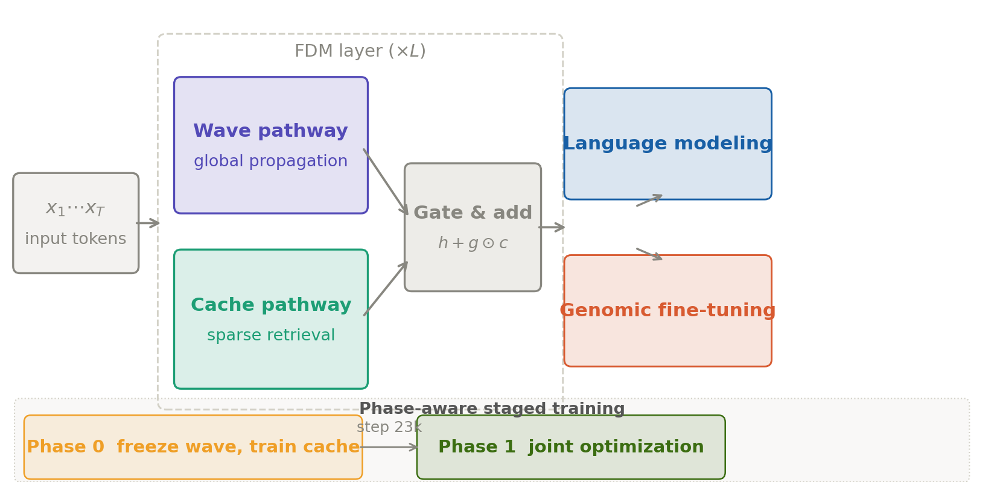
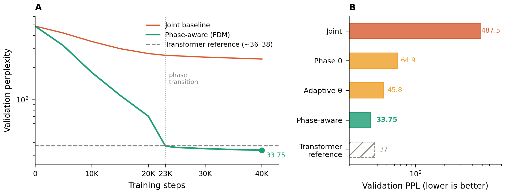
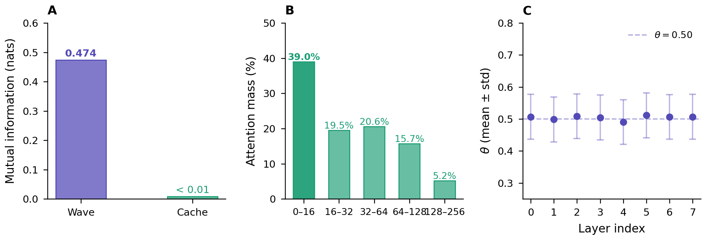
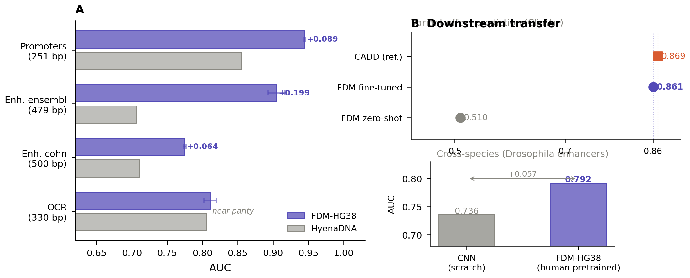

# FDM: Fan Duality Model

**A Wave-Cache Architecture with Phase-Aware Training for Language and Genomic Sequence Modeling**

[](LICENSE)
[](https://www.python.org/)
[](https://pytorch.org/)

> Chinese Patent No. 2026104740169

---

## Overview

FDM separates sequence processing into two dedicated channels:

- **Wave channel** — norm-preserving recurrent propagation via Givens-rotation phase operators
- **Cache channel** — sparse associative retrieval over W local + K global slots, independent of sequence length N

A central finding is that jointly training these two channels produces a **gradient sink**: scan parameters dominate gradient flow, leaving the cache severely undertrained. **Phase-aware staged training** resolves this.



*Fig. 1: FDM architecture and phase-aware training. Wave and cache channels are combined via a learned gate. Phase 0 freezes wave parameters to allow cache specialisation; Phase 1 resumes joint optimisation after automatic transition at step 23,000.*

---

## Results

### Language Modeling



*Fig. 2: (A) Training dynamics on WikiText-103. Phase-aware FDM converges to PPL=33.75, below the Transformer reference (~36–38). (B) PPL by configuration — joint training collapses to 487.5 due to the gradient sink.*

| Model | Val PPL ↓ |
|-------|-----------|
| Transformer (reference, ~137M) | ~36–38 |
| FDM — joint training | 487.5 |
| FDM — Freeze-Scan (Phase 0 only) | 64.9 |
| **FDM — phase-aware (full)** | **33.75** |

---

### Wave–Cache Functional Analysis



*Fig. 3: (A) Wave channel carries substantially more mutual information than cache channel. (B) Cache attention exhibits locality bias (39% within distance 16). (C) Wave θ is uniform across layers (λ ≈ 12.5 tokens) — no emergent multi-scale hierarchy.*

---

### Genomic Benchmarks



*Fig. 4: (A) AUC on four genomic benchmarks (mean ± std, 3 seeds). Clear gains on promoter and enhancer tasks; near parity on OCR. (B) Variant effect prediction approaches CADD; cross-species transfer to Drosophila (+0.057 vs CNN from scratch).*

**AUC (mean ± std, 3 seeds)**

| Task | Seq. len | FDM-HG38 | HyenaDNA | Δ |
|------|----------|----------|----------|---|
| human_nontata_promoters | 251 bp | **0.945 ± 0.001** | 0.856 | +0.089 |
| human_enhancers_ensembl | 479 bp | **0.905 ± 0.012** | 0.706 | +0.199 |
| human_enhancers_cohn    | 500 bp | **0.775 ± 0.002** | 0.711 | +0.064 |
| human_ocr_ensembl       | 330 bp | **0.811 ± 0.009** | 0.806 | +0.005 |

**Variant Effect Prediction (ClinVar chr17, 5-fold CV)**

| Method | AUC |
|--------|-----|
| FDM zero-shot | 0.51 |
| CADD (reference) | 0.869 |
| **FDM fine-tuned** | **0.861 ± 0.011** |

**Cross-Species Transfer (Drosophila enhancers)**

| Model | AUC |
|-------|-----|
| CNN from scratch | 0.736 |
| **FDM-HG38 (human pretrained)** | **0.792** |

---

## Repository Structure

```
FDM/
├── README.md
├── LICENSE
├── requirements.txt
│
├── train_130m.py           # FDM language model + phase-aware training
├── genomics_hg38.py        # Genomic model + hg38 pretraining
├── triton_scan_v2.py       # Triton kernel for Givens-rotation scan
├── genomic_multiseed.py    # Multi-seed genomic benchmark evaluation
├── vep_finetune.py         # ClinVar variant effect prediction fine-tuning
│
├── scripts/
│   ├── pretrain_lm.sh      # Language model pretraining
│   ├── pretrain_genomic.sh # Genomic pretraining on hg38
│   └── eval_benchmarks.sh  # Run all genomic benchmarks
│
├── assets/                 # Figures for README
│   ├── fig1_architecture.png
│   ├── fig2_lm.png
│   ├── fig3_analysis.png
│   └── fig4_genomic.png
│
├── paper/
│   ├── main.tex            # LaTeX source (Nature MI submission)
│   └── cover_letter.pdf
│
└── checkpoints/
    └── README.md           # Pretrained checkpoint download instructions
```

---

## Installation

```bash
git clone https://github.com/YasongFan/FDM.git
cd FDM
pip install -r requirements.txt
```

**Requirements:** Python 3.10+, PyTorch 2.1+, Triton 3.0+, CUDA 12+

---

## Usage

### Phase-Aware Language Model Training

```bash
# Phase 0: freeze wave channel, train cache only (0–23K steps)
python train_130m.py --phase 0 --steps 23000 --lr 1e-4 \
  --data data/tokens_130m.pt --save checkpoints/fdm_phase0.pt

# Phase 1: joint optimisation (23K–40K steps)
python train_130m.py --phase 1 --steps 40000 --lr 3e-5 \
  --resume checkpoints/fdm_phase0.pt \
  --save checkpoints/fdm_phase_aware.pt
```

### Genomic Pretraining on hg38

```bash
python genomics_hg38.py \
  --genome_dir data/hg38_full/ --steps 95000 \
  --d 512 --n_layers 8 --cache_k 32 --local_window 128 \
  --save checkpoints/fdm_hg38.pt
```

### Benchmark Evaluation

```bash
python genomic_multiseed.py \
  --checkpoint checkpoints/fdm_hg38_step54k.pt \
  --seeds 42 123 456
```

### Reproduce Paper Figures

```bash
python figures/generate_figures.py
# Outputs fig1–fig4 + supp_memory as PDF and PNG
```

---

## Pretrained Checkpoints

| Checkpoint | Val PPL | Description |
|------------|---------|-------------|
| `fdm_phase_aware_lm.pt` | 33.75 | Language model, WikiText-103 |
| `fdm_hg38_step95k.pt`   | 3.23  | Genomic model, full hg38 pretraining |
| `fdm_hg38_step54k.pt`   | 3.37  | Genomic model used in benchmark experiments |

Hosted at `https://huggingface.co/YasongFan/FDM` (available upon paper publication).
See `checkpoints/README.md` for loading instructions.

---

## Citation

Paper under review. If you use this code, please cite:

```bibtex
@article{fan2026fdm,
  title={A Wave-Cache Architecture with Phase-Aware Training
         for Language and Genomic Sequence Modeling},
  author={Fan, Yasong},
  year={2026},
  note={Preprint. Chinese Patent No. 2026104740169}
}
```

---

## License

MIT License — see [LICENSE](LICENSE).  
Chinese Patent No. 2026104740169.
